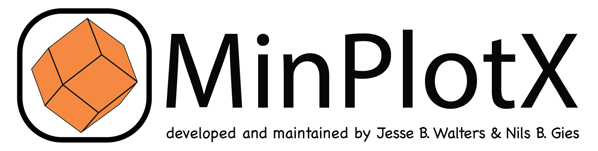

#  
[Download MinPlotX here!](https://github.com/NilsGies/MinPlotX/releases/latest).

## What is MinPlotX?

MinPlotX is an open-sourced MATLAB®-based mineral formula recalculation and compositional plotting program with an easy-to-use stand-alone graphical user interface (GUI) as well as an advanced programming interface (API). Compiled versions of MinPlotX do not require a MATLAB® license to run. The uncompiled version is also available for users who wish to modify the source code.

### Highlights of MinPlotX
- The program can read as input various types of data files (*e.g.*, .txt, .csv, .xlsx) that contain columns of data as mass percents (wt %) of oxides (or elements for sulfides). Input data columns can be arranged in any order.
- Input data can include metadata such as mineral name, sample name, analysis location (e.g., core, mantle, rim), rock type, metamorphic grade, transect/line distance, or any other kind of metadata.
- Metadata can be used to classify mineral analyses during plotting (*e.g*., plotting cores vs rims with different colors, symbols, etc.). 
- In addition to predefined classification plots provided automatically for various minerals, users can create and modify their own diagrams. 
- Advanced users can modify or create new functions for mineral formula recalculation and plotting routines in the uncompiled version of MinPlotX.

MinPlotX currently offers recalculation and structural formula assignment for 21 different minerals/mineral groups: Allanite, amphibole, apatite, chlorite, chloritoid, cordierite, epidote, feldspar, garnet, ilmenite, lawsonite, mica, olivine, oxyspinel, pyroxene, scapolite, serpentine, staurolite, sulfides, talc, and titanite. 

## Getting Started
MinPlotX is downloaded and installed as an application and compiled versions are available for Windows, Mac, and Linux users. You can download the file that is suitable for your operating system [here](https://github.com/NilsGies/MinPlotX/releases/latest). Detailed instructions on how to install MinPlotX can be found in the Quick Start Guide.
### The MinPlotX download includes:

- A Quick Start Guide with examples and information for an easy start with MinPlotX
- A documentation file explaining the recalculation and plotting procedures for each mineral
- Example input files of natural and synthetic mineral data (in the installation directory of MinPlotX)
  - Synthetic mineral data are calculated from ideal endmember formulas in various ways (e.g., including or excluding H2O)

## Report Issues
MinPlotX was developed by a small, dedicated team of two geoscientists without special training in software development as a side project within a relatively short time frame. Despite our best efforts to test all features and implement routines to prevent errors, as with any complex software, there may still be ways in which users could potentially cause the software to malfunction. If you encounter problems, please send us a description of the issue and an example dataset so that we can work on improving MinPlotX. 

<a href="mailto:nils.gies@unibe.ch,jesse.walters@uni-graz.at?subject=MinPlotX">Send us a message here!</a>

## Citation Guidelines

We recommend that you use the following citations in your publications or presentations when referring to data processed and visualization with MinPlotX, e.g., data were processed and visualized with MinPlotX (Walters & Gies 2024).

Jesse B. Walters & Nils B. Gies, MinPlotX: A powerful tool for formula recalculation, visualization, and comparison of large mineral compositional datasets, [https://doi.org/10.31223/X5FX5N](https://doi.org/10.31223/X5FX5N)

It is not recommended to cite MinPlotX only in the supplementary material, as these citations are not taken into account by citation statistics platforms. 

This work is licensed under a [GPL-3.0 license](https://www.gnu.org/licenses/gpl-3.0.en.html).
